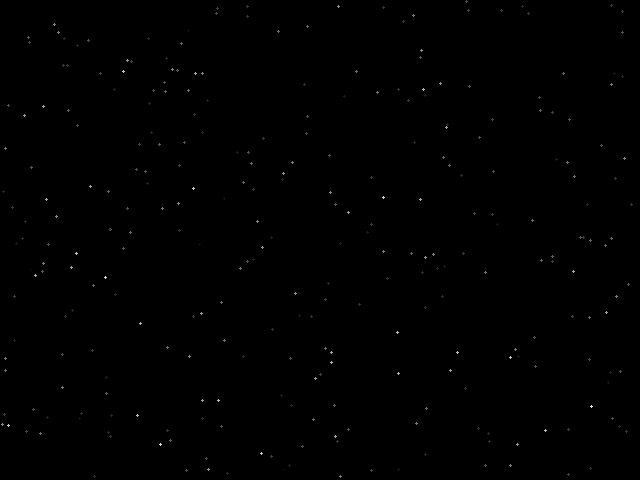

# C-WASM-STARS
Stars screensaver implementation in C compiled to Wasm.

## Demo
[Live demo](https://vladislavpetyukevich.github.io/c-wasm-stars/)  

## Build
Run `build.sh` to build this project.  
Clang is required to build this project.  
Run `npm run serve` to start local server with local build.  
